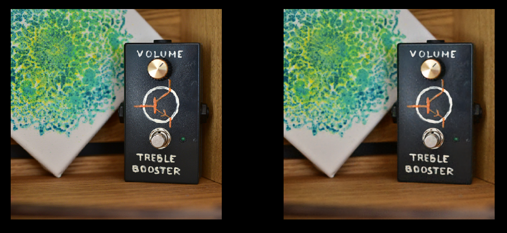

# Real-Time Neural Network Implementation for GPUs 

This is a code accompanying the chapter "Real-Time Neural Network Implementation for GPUs " in GPU Zen 4 book. All relevant details can be found in the book.

 Example of neural network lerning to infer an image - reference on the left, inference on the right.

## Build Instructions
For the first build, **run the Visual Studio as an Administrator**. Build process will create symbolic links to folder with shaders, which can fail on some systems if VS is run without administrator rights.

* Run `cmake` on the *src* subfolder and build the generated project
* Or run provided file `create_vs_project.bat` and build the project generated in the *vsbuild* subfolder (requires Visual Studio 2022)

*Note:* First start takes about a minute, because shaders need to be compiled. Subsequent runs are faster.

### Troubleshooting
If you get an error *Error: failed to get shader blob result!*, it most likely means that build didn't create a symbolic link for shaders folder in the build directory and executable can't find shader files. To fix this, run Visual Studio as administrator, clean the solution and run the build again.

## Bibtex Citation

```bibtex
@incollection{jbmlpzen2026,
  title={Real-Time Neural Network Implementation for GPUs},
  author={Jakub Bok\v{s}ansk\'y},
  booktitle={{GPU} {Zen} 4: Advanced Rendering Techniques},
  year={2026}
}
```

## 3rd Party Software

This project uses following dependencies:
* [d3dx12.h](https://github.com/Microsoft/DirectX-Graphics-Samples/tree/master/Libraries/D3DX12), provided with an MIT license. 
* [STB library](https://github.com/nothings/stb/), provided with an MIT license.
* [DXC Compiler](https://github.com/microsoft/DirectXShaderCompiler), provided with an University of Illinois Open Source
* [ImGUI](https://github.com/ocornut/imgui), provided with an MIT license.
* [GLM library](https://github.com/g-truc/glm), provided with an MIT license.
